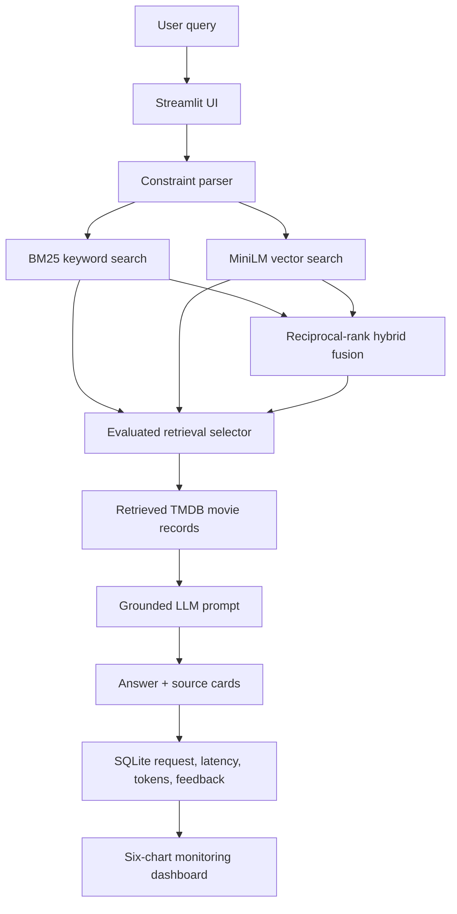

# 🎬 CineGuide — Movie Discovery RAG

CineGuide is a retrieval-augmented movie discovery application. A user can ask
for a mood, theme, filmmaker, release period, or runtime in natural language and
receive grounded recommendations with the source movie records shown alongside
the answer.

The project was built as an original LLM application. It does not reuse code
from an earlier recommender-system course project.

## Problem

Conventional movie filters work well when a viewer already knows a genre or
title. They work poorly for requests such as:

- “Cerebral sci-fi like Arrival, but no horror.”
- “Christopher Nolan movies about time.”
- “Crime mysteries after 2015 under 140 minutes.”
- “Why might I like Blade Runner 2049 if I liked Dune?”

CineGuide retrieves relevant movie records first and then asks an LLM to answer
only from that context. If no LLM key is configured, it produces a deterministic
grounded answer, so the full UI remains usable offline.

## Architecture



Vector search is the application default because it achieved the best MRR in
the checked-in evaluation. Keyword and hybrid retrieval remain selectable in
the UI and are evaluated by the same script.

## Features

- TMDB API ingestion with retries, pagination, credits, keywords, runtime, and
  genres
- A committed 28-movie demo source for key-free, reproducible startup
- sentence-transformer vector retrieval using `all-MiniLM-L6-v2`
- BM25 keyword retrieval
- weighted reciprocal-rank fusion for hybrid retrieval
- parsed `after`, `before`, runtime, and excluded-genre constraints
- grounded OpenAI-compatible answer generation with two evaluated prompts
- key-free fallback answers that never leave the retrieved records
- Streamlit web interface with visible source records and TMDB IDs
- thumbs-up/down feedback stored in SQLite
- monitoring for traffic, latency, retrieval methods, feedback, tokens, and top
  queries
- Docker Compose deployment and lightweight GitHub Actions CI

## Repository layout

```text
cineguide-rag/
├── .github/workflows/ci.yml
├── data/
│   └── demo_movies.json
├── evaluation/
│   ├── questions.json
│   ├── retrieval.py
│   └── llm_eval.py
├── tests/
├── app.py
├── ingest.py
├── monitoring.py
├── rag.py
├── settings.py
├── Dockerfile
├── docker-compose.yml
├── requirements.txt
└── .env.example
```

Generated indexes, evaluation result JSON, SQLite data, environments, and
secrets are deliberately excluded from Git.

## Quick start on Windows

Requirements: Python 3.11 and an internet connection for the first embedding
model download.

```powershell
git clone https://github.com/JavaProgswing/cineguide-rag.git
cd cineguide-rag

py -3.11 -m venv .venv
.\.venv\Scripts\Activate.ps1
python -m pip install -r requirements.txt

Copy-Item .env.example .env
python ingest.py --source demo
streamlit run app.py
```

Open `http://localhost:8501`. The demo does not require a TMDB or LLM key.

## Docker

```powershell
Copy-Item .env.example .env
docker compose up --build
```

The image builds the demo search index and exposes Streamlit on port 8501.
SQLite monitoring data is persisted in the `cineguide-state` named volume.

## Use fresh TMDB data

1. Create a TMDB API key from the TMDB developer settings.
2. Put it in the local `.env` file. Never commit `.env`.
3. Run ingestion with the desired catalog size.

```powershell
python ingest.py --source tmdb --pages 50 --max-movies 1000
streamlit run app.py
```

Each indexed movie contains its TMDB ID, title, overview, genres, release date,
rating, runtime, keywords, leading cast, director, and poster path. Re-run the
evaluation whenever the corpus or embedding model changes.

### Environment variables

| Variable | Required | Default | Purpose |
|---|---:|---|---|
| `TMDB_API_KEY` | TMDB ingest only | none | Fetch fresh movie metadata |
| `LLM_API_KEY` | No | none | Enable API-backed RAG answers and LLM evaluation |
| `LLM_BASE_URL` | No | OpenAI API | Use OpenAI or a compatible provider |
| `LLM_MODEL` | No | `gpt-5.4-mini` | Generation and judge model |
| `EMBEDDING_MODEL` | No | `all-MiniLM-L6-v2` | Sentence-transformer model |
| `DATA_DIR` | No | `data` | Generated search index directory |
| `DATABASE_PATH` | No | `data/cineguide.db` | SQLite monitoring database |

## Retrieval evaluation

`evaluation/questions.json` contains 30 hand-labeled discovery queries and
relevant TMDB IDs. The evaluation compares the exact three retrieval paths used
by the app at `top_k=5`.

```powershell
python -m evaluation.retrieval
```

Verified on the 28-movie demo corpus with `all-MiniLM-L6-v2`:

| Retrieval method | Hit Rate | MRR |
|---|---:|---:|
| Keyword BM25 | 1.000 | 0.932 |
| Vector | 1.000 | **1.000** |
| Hybrid RRF | 1.000 | 0.967 |

Vector retrieval is therefore the current default. The demo corpus and question
set are intentionally small, so these numbers validate the evaluation pipeline
rather than claim production generalization. A final submission should ingest a
larger TMDB snapshot, extend the judgments, rerun the script, and commit the
result JSON or summarized table.

The CI job uses deterministic hashing vectors only to test the pipeline without
downloading a model. Those CI fallback scores are not production evaluation
results.

## LLM evaluation

The LLM evaluation independently compares `concise` and `structured` prompts.
For each prompt it records 1–5 relevance, faithfulness, and clarity scores from
an LLM judge, along with the answer, rationale, and token usage.

```powershell
# Set LLM_API_KEY and optionally LLM_BASE_URL / LLM_MODEL in .env first.
python -m evaluation.llm_eval --limit 15
```

Results are written to `evaluation/results/llm.json`. The script intentionally
requires a key instead of pretending that a heuristic is an LLM-as-judge result.
Review a sample manually as well: automated judges can be biased toward verbose
answers and toward their own model family.

## Feedback and monitoring

Every request records:

- UTC timestamp and query
- answer and retrieved movie IDs
- retrieval method and latency
- prompt/completion token counts
- optional positive or negative feedback

The Monitoring page contains six live views:

1. queries per day
2. latency over time
3. retrieval method usage
4. feedback distribution
5. token usage over time
6. most frequent queries

No API keys are stored in SQLite.

## Testing

```powershell
python -m pytest
python -m ruff check .
python -m compileall -q .
```

Tests cover query constraints, all three retrievers, grounded fallback answers,
retrieval metrics, request logging, and feedback updates. CI uses
`requirements-ci.txt` and hashing embeddings to stay fast and deterministic.

## Rubric coverage

| Area | Implementation |
|---|---|
| Problem description | Natural-language movie discovery problem and examples |
| Retrieval flow | BM25, MiniLM vector, hybrid RRF, filters, grounded context |
| Retrieval evaluation | 30 labeled queries, Hit Rate and MRR, three methods |
| LLM evaluation | Two prompts, LLM judge, three answer metrics |
| Interface | Streamlit app with results and source cards |
| Ingestion | Re-runnable Python pipeline for demo or TMDB API |
| Monitoring | SQLite feedback plus six dashboard charts |
| Containerization | Dockerfile, health check, Compose, persistent state |
| Reproducibility | Key-free demo, environment template, CI, tests, commands |

## Data and attribution

The bundled records contain factual metadata and short project-written
descriptions for reproducible demonstration. Fresh records come from the TMDB
API. This product uses the TMDB API but is not endorsed or certified by TMDB.
Review TMDB's attribution and API terms before public deployment, and add the
required TMDB logo to a deployed interface.

## Known limitations and next steps

- The demo is deliberately small; production retrieval needs a larger, versioned
  snapshot and broader human relevance judgments.
- The rule-based constraint parser handles common year, runtime, and excluded
  genre phrases, not every possible phrasing.
- TMDB popularity and ratings change over time; freeze the final evaluation
  snapshot for reproducible submission metrics.
- LLM answers can still be imperfect. The source cards and feedback controls are
  present so users can inspect and report them.
- Strong next additions are a cross-encoder reranker, query rewriting experiment,
  human evaluation sample, and a hosted deployment.

## Submission checklist

- [x] Publish the project and set the clone URL.
- [ ] Add UI and monitoring screenshots after final styling.
- [ ] Ingest the final corpus and rerun both evaluations.
- [ ] Commit only safe, reproducible files; confirm `.env` is ignored.
- [ ] Push the public repository.
- [ ] Record the evaluated commit with `git rev-parse --short HEAD`.
- [ ] Submit the repository URL and that seven-character commit ID.
